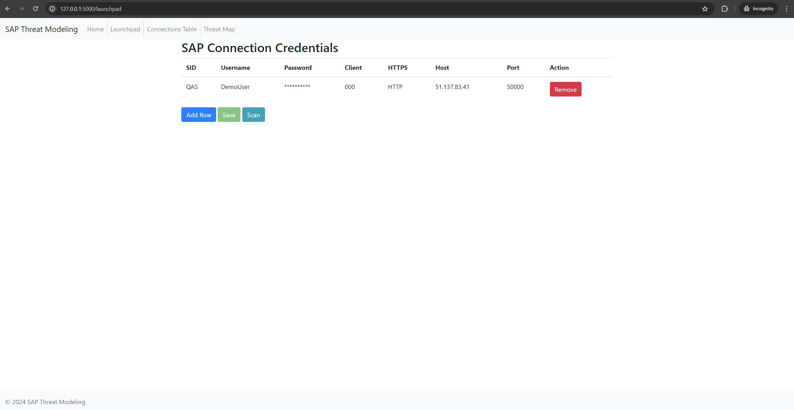
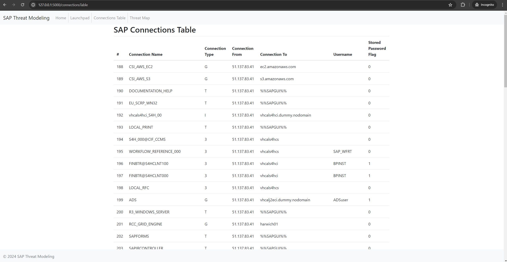
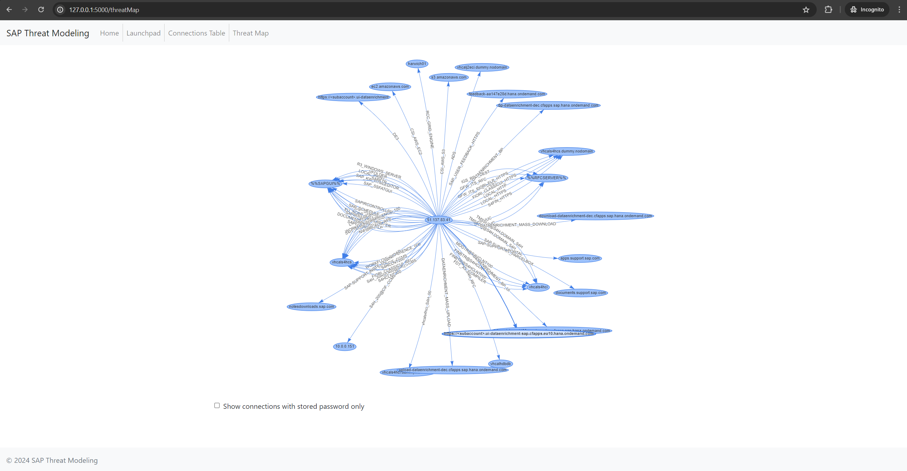
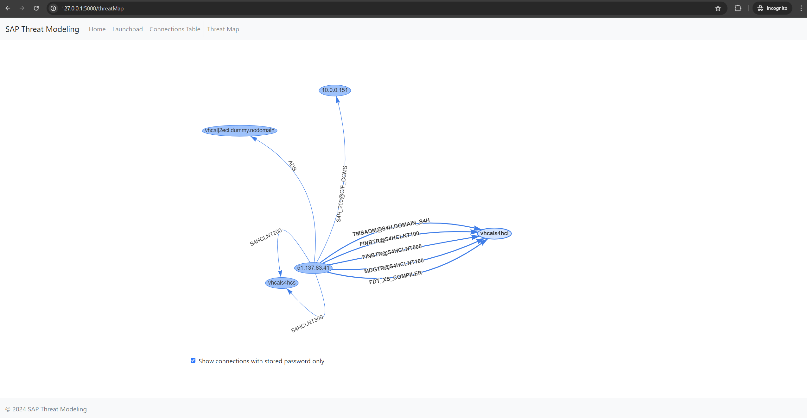

<div style="text-align:center">
    
</div>

# SAP Threat Modeling Tool - Readme

This tool helps you analyze and visualize connections between your SAP systems, enabling identification of potential security risks and vulnerabilities.

For more detailed information about potential threats in SAP systems related to inter-SAP connections, visit [this page](https://redrays.io/blog/securing-sap-server-connections-threat-modeling/).
## Features:

- **Input SAP Credentials:** Enter system details (SID, username, password, etc.) to establish initial connections.
- **Scan for Inter-SAP Connections:** Discover and display connections between your SAP systems, including usernames and password storage flags.
- **Visualize the Network:** View a graph representation of your SAP network, highlighting connections with potential security concerns.
- **Filter Connections:** Focus on specific connections, such as those with stored passwords.

## Usage:

1. **Initiate Connections:**
    - Navigate to the "Init Connections" page.
    - Enter SAP system credentials similar to the format shown in this .
    - Save the connection details and click "Scan" to start the analysis.

2. **View Existing Connections:**
    - After the scan is completed, go to the "Connections Table" page.
    - Here, you can view all existing connections in a tabular format as depicted in this .

3. **Explore Inter-SAP Connections:**
    - Alternatively, visit the "Graph Connection" page to visualize the inter-SAP connections in a graph format like shown in this .
    - You can filter the connections to display only those with saved passwords, as demonstrated in this .


## Installation:

1. Clone the repository:
    ```bash
    git clone https://github.com/redrays-io/SAP-Threat-Modeling-Tool.git
    ```
    Use code with caution.

2. Install dependencies:
    ```bash
    pip install -r requirements.txt
    ```
    Use code with caution.

3. Run the application:
    ```bash
    python app.py
    ```
    Use code with caution.

4. Access the web interface: Open [http://localhost:5000](http://localhost:5000) in your browser.


## Docker Setup:
Alternatively, you can set up the tool using Docker with the following command:

```bash
docker pull ghcr.io/redrays-io/sap-threat-modeling:latest
```

## Security Considerations:

- **Credential Storage:** This tool stores SAP credentials in a local SQLite database. Ensure proper security measures for the database file.
- **Data Sensitivity:** The tool exposes information about SAP connections and potential vulnerabilities. Limit access to authorized personnel only.
- **Production Use:** This tool is intended for development and testing purposes. Evaluate its suitability before using it in production environments.
